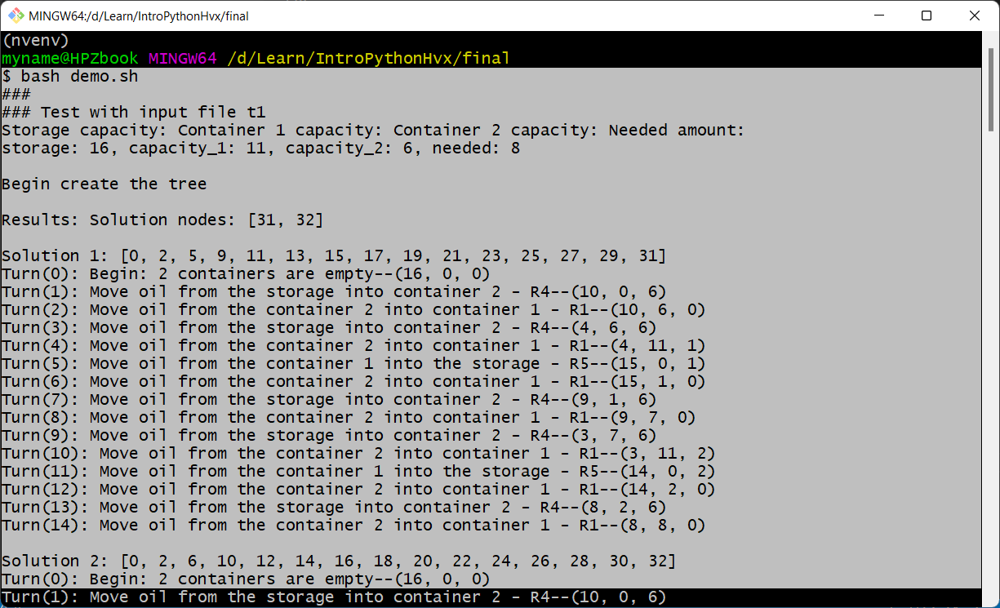

# SOLVING AN ANCIENT PROBLEM WITH A TREE GENERATED BY A MINI RULE-BASED SYSTEM
#### Video Demo:  <URL HERE>
#### Description: 
- The seller has:
    - A storage with X liters of oil and 
    - two empty containers with capacities Y1 and Y2. Each container has no line (no sign) to show how much it contains. So, he can fill until the container is full or any amount that he can. 

- A customer wants to buy Z liters of oil.
- How can the seller know the process to get Z liters for his customer?
- In this problem, all values X, Y1, Y2, and Z are supposed to have positive integers.

This problem is often used as an example for heuristic algorithm problem in some AI course.

I solve it by finding solution nodes in a tree generated by a mini rule-based ststem.

My tree is a finite tree, so when there is no solution node in the tree, we conclude there is no solution.
By the properties of the problem, usually there is 2 solutions in 2 containers or no solution.

#### Example 1
X = 16, Y1 = 11, Y2 = 8, Z = 6
- The seller has 16 liters of oil. (X = 16)
- The first container has the capacity of 11 liters. (Y1 = 11)
- The second container has the capacity of 8 liters. (Y2 = 8)
- The customer wants to buy 6 liters of oil. (Z = 6)

#### Example 2
X = 16, Y1 = 10, Y2 = 6, Z = 5
- The seller has 16 liters of oil. (X = 16)
- The first container has the capacity of 10 liters. (Y1 = 10)
- The second container has the capacity of 6 liters. (Y2 = 6)
- The customer wants to buy 5 liters of oil. (Z = 5)

## Solving Description
Our solution is:
- Create a tree contains many nodes.
- Each node has an unique status represented by a tuple in Python that contains 3 values: (n_storage, n_capacity1, n_capacity_2)
    - n_storage: new amount of oil in the storage.
    - n_capacity1: new amount of oil in the container 1
    - n_capacity2: new amount of oil in the container 2
- If there exists a node that Z = n_capacity1 or Z = n_capacity2, the seller can find a process to get Z liters for his customer, this node is called a solution node.
- The set {(x1, x2, x3): x1, x2, x3 positive integers and x1+x2+x3=X} has a finite number of elements.
Our graph has a finite amount of nodes, because n_storage + n_capacity1 + n_capacity_2 = X. 
- If there is no solution node in the graph then we conclude the problem has no solution.
- The root node of the graph has the status is (X, 0, 0). This is the status of 2 empty containers.
- We use the technique of rule-based system to generate the graph. 
- There are 6 rules to generate our graph:
    1. Move oil from the container 2 into container 1 - R1',
    2. Move oil from the storage into container 1 - R2',
    3. Move oil from the container 1 into container 2 - R3',
    4. Move oil from the storage into container 2 - R4',
    5. Move oil from the container 1 into the storage - R5',
    6. Move oil from the container 2 into the storage - R6'
- By the properties of the problem, usually we have 2 solutions or no solution.

### Solution tree example

With X = 16, Y1 = 11, Y2 = 6, Z = 5. In the level 2 of the tree we can see 2 solutions:
- (5, **5**, 6) solution in container 1
- (0, 11, **5**) solution in container 2. 


## Programming
We have 2 python files: 
- *mynode.py*  
- *project.py*.

### mynode.py

In this file, we have class *Node* and the function *get_vars()*

#### Class Node

Class Node has 8 properties and 4 methods:
```
class Node:
    def __init__(self, 
            id, parent_id, 
            n_storage, 
            container_1, 
            container_2,
            path, 
            rule, 
            level
            ):
            
        self.id = id                    # id of the node: int
        self.parent_id = parent_id      # id of the parent of the node: int
        self.n_storage = n_storage      # new capacity of the storage: int
        self.container_1 = container_1  # new capacity of the container 1: int
        self.container_2 = container_2  # new capacity of the container 2: int
        self.path = path                # list of nodes from root: list
        self.rule = rule                # id of the rule creating the node: int
        self.level = level              # level of the node: int
        

    def __str__(self):
        """
        For checking anh printing
        """
        return f'Node({self.id}, {self.parent_id}, {self.n_storage}, ' \
            f'{self.container_1}, {self.container_2}, {self.path}, {self.rule}, {self.level})'

    def create_pseudo_node(self, containers, id, n_storage, rule):
        """
        Get important values and return a dictionary of important values 
        to check if a new node can be created
        """

    def activate_rules(self, storage, capacity_1, capacity_2):
        """
        From the properties of this node, we check 6 rules to create the list of pseudo_nodes.
        """
```

#### Function get_vars()
```
def get_vars():
    """
    Get user inputs: storage = X, capacity_1 = Y1, capacity_2 = Y2, needed = Z
    """
```

### project.py

```
from mynode import Node, get_vars

# Rule 0 represent the initiation of the tree
rules = [
        'Begin: 2 containers are empty',
        'Move oil from the container 2 into container 1 - R1',
        'Move oil from the storage into container 1 - R2',
        'Move oil from the container 1 into container 2 - R3',
        'Move oil from the storage into container 2 - R4',
        'Move oil from the container 1 into the storage - R5',
        'Move oil from the container 2 into the storage - R6'
    ]

def main():
    # storage = X, capacity_1 = Y1, capacity_2 = Y2, needed = Z
    storage, capacity_1, capacity_2, needed = get_vars()
    ...

    
def is_solution(node, needed):
    """
    Check to return True if node is a solution node else Fase
    """
    ...

def create_tree(storage, capacity_1, capacity_2, needed):
    """
    Create the first node of the tree
    Create the first value of container list
    Create the tree and find if the solution nodes exist in the tree
    Return the results dictionary with the details of the path from root to the node having the needed value and the complete tree.
    """    
    tree = {}
    lst_containers = []
    tree[0] = Node(0, 0, storage, 0, 0, [0], 0, 0)
    lst_containers.append((0,0))
    result = []
    ...

    return result, tree

def get_node_info(node):
    """
    return necessary info to print the result.
    """
    ...
```
## Running the program

### Run with user input


### Run with text file replacing the user input

For quick testing and easy running, we use text file to replace user inputs:
For example, we create a text file named t5 contains for lines contains four values 16, 11, 6, 5 and run by 2 ways:
```
$ python project.py < t5
or
$ cat t5 | python project.py
```


### Run and save the result in a text file

We can save the result output in a text file to review, especially when the output is too long. The following command help us to view both the result on the screen and the result in the text file. Command *less* help us view each page if the content is large. 
```
    $ cat t1 | python project.py | tee result.t1
    ...
    $ ls result.t1
```

```
    $ less result.t1
```


### Run multiple testing with a shell script
We prepare some text file containing compatible values that replace the user inputs:
- t1, t2, t3, t4, t5 : 2 solution nodes in each case.
- f1, f2: no solution node in each case.

We create a shell script demo.sh:


Run by command:
```
    $ bash demo.
    ...
```

Too much results, but we can view each correspondent result file.


...
...


For easy following, we can redirect output to the /dev/null (as the null bin) and see each result file.

Run by command:
```
    $ bash demo.sh > /dev/null
    ...
    $ cat result.f1
    ...
    $ less result.t1
    ...
```


